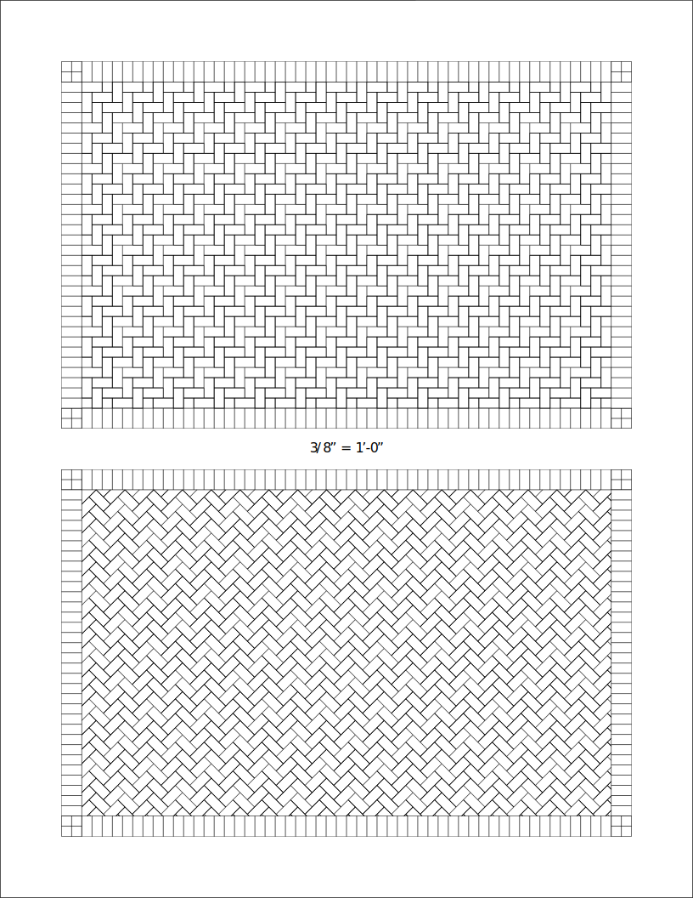

## About the project

This asymptote code serves to define a series of common paving patterns and to generate templates for tracing using standard architect scaling.

## Usage

The code defines a number of paving patterns:

* running_bond
* stack_bond
* herringbone
* basket_weave
* basket_weave_stack_bond
* basket_weave_variation
* flagstone

Each of these patterns can be used as normal:

```asymptote

import patterns;
import paving;

unitsize(1inch);

add("running_bond", running_bond());
add("stack_bond", stack_bond());
add("herringbone", herringbone());
add("basket_weave", basket_weave());
add("basket_weave_stack_bond", basket_weave_stack_bond());
add("basket_weave_variation", basket_weave_variation());
add("flagstone", flagstone());

filldraw(shift(2, 0)*unitcircle, pattern("running_bond"));
filldraw(shift(4, 0)*unitcircle, pattern("stack_bond"));
filldraw(shift(6, 0)*unitcircle, pattern("herringbone"));
filldraw(shift(8, 0)*unitcircle, pattern("basket_weave"));
filldraw(shift(2, -2)*unitcircle, pattern("basket_weave_stack_bond"));
filldraw(shift(4, -2)*unitcircle, pattern("basket_weave_variation"));
filldraw(shift(6, -2)*unitcircle, pattern("flagstone"));

```

with the following result:


Single pattern templates can be generated using the function `architect_page`:

```asymptote

% The arguments are:
% 1. pattern string
% 2. scale in inches (to feet), e.g., 1/4 transates to 1/4'' on page is 1' in life
% 3. string for scale label -- "1/4" looks better than the default of str(scale)
% 4. width of brick (or flagstone) in real-life inches -- 8'' is the default
% 5. width of border brick -- 8'' is the default
% 6. margin width (modified slight to ensure border fits without trimming)
% 7. shipout -- default is to generate pdf, but can be set to false
% 8. pen
% This function is meant to generate pdfs but it also outputs picture for editing.
architects_page("herringbone", 1/4, "1/4", 8);
```

with the following result:



Multiple pattern templates can also be generated at once, although this can take a bit longer:

```asymptote

string[] brick_patterns = {
  "running_bond", "stack_bond", "herringbone",
  "basket_weave", "basket_weave_stack_bond", "basket_weave_variation"
};

string[] flagstone_patterns = {
  "flagstone"
};

real[] scales = {1/4, 3/8};
string[] scale_strings = {"1/4", "3/8"};

architects_pages(brick_patterns, scales, scale_strings, 8);
architects_pages(flagstone_patterns, scales, scale_strings, 12);
```
